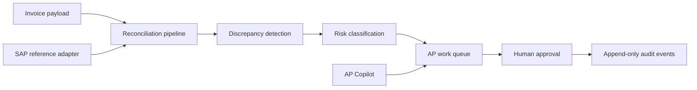

# AP Three-Way-Matching Agent

A working SAP Accounts Payable reconciliation pilot built with SAP CAP and React. It compares invoices with purchase orders and goods receipts, classifies discrepancies, and routes exceptions through a human-reviewed work queue with an append-only audit trail.


## What it demonstrates

- A rules-first reconciliation pipeline covering 14 discrepancy types
- Configurable price, quantity, currency, entity, UoM, duplicate, and reference checks
- Risk-based routing to auto-correct recommendations, review, or escalation
- Explicit human approval before any correction or write-back action
- A clerk work queue, invoice detail view, event timeline, and configuration UI
- An AP Copilot interface backed by live queue data
- A pluggable provider boundary for local mock mode, Anthropic, or SAP AI Core
- A mock SAP adapter for local development and a read-only S/4HANA Cloud adapter

The repository is intentionally a portfolio pilot, not a production posting system. S/4HANA write-back is disabled, authentication is mocked for local use, and all included records are synthetic.


## Architecture



The backend uses SAP CAP services over a CDS domain model. The React application consumes the CAP OData endpoints through a local Vite proxy. SQLite and deterministic seed scenarios make the full workflow runnable without external credentials.

## Run locally

Requirements: Node.js 20 or newer.

```bash
npm ci
npm run dev
```

In a second terminal:

```bash
cd app/react-ui
npm ci
npm run dev
```

Open `http://localhost:5173`. The local profile uses mock authentication and seeded synthetic data; no API key is required.

To configure a supported model provider or S/4HANA Cloud read adapter, copy `.env.example` to `.env` and set only the values you need.

## Quality checks

```bash
npm run lint
npm test
npm run build
cd app/react-ui && npm run build
```

The unit suite covers detector behavior, confidence scoring, risk assignment, material mismatch handling, and wrong-document classification.

## Repository guide

- `db/` — CDS domain model and synthetic reconciliation scenarios
- `srv/lib/agent/` — parsing, detection, diagnosis, and resolution logic
- `srv/lib/adapters/` — mock and S/4HANA Cloud adapter boundary
- `srv/lib/ai/` — mock, Anthropic, and SAP AI Core provider boundary
- `srv/*-service.*` — CAP APIs for processing, review, and the AP Copilot
- `app/react-ui/` — React operations interface
- `test/unit/` — focused unit coverage for reconciliation rules

## License

MIT
