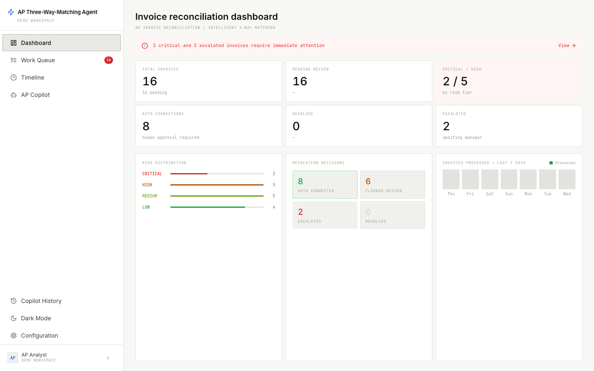
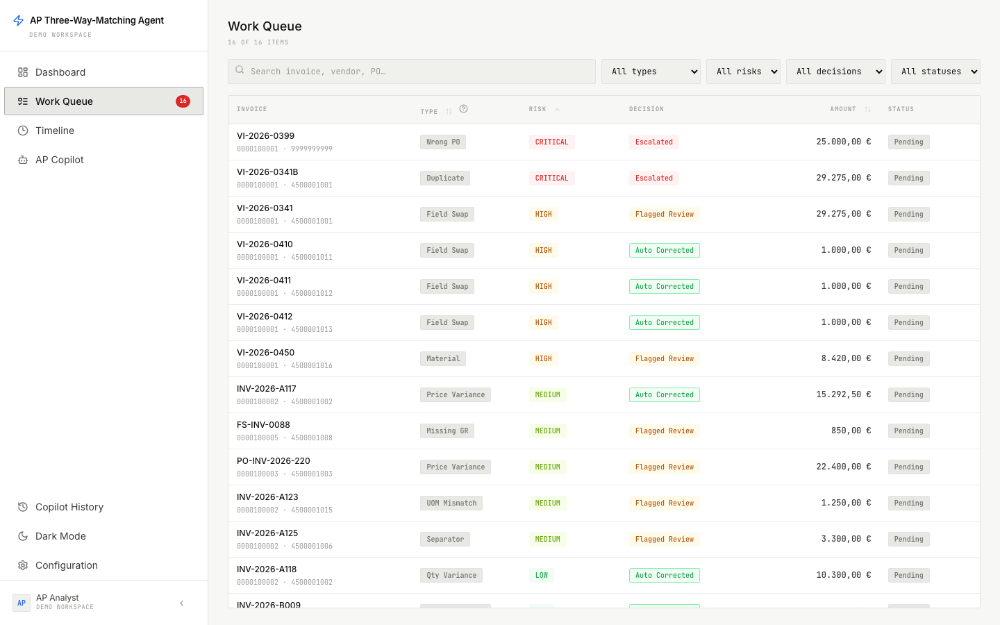
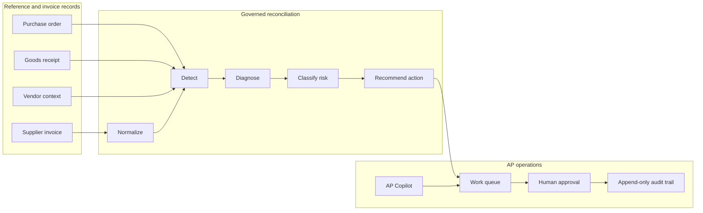

# AP Three-Way-Matching Agent

From blocked supplier invoices to an explainable next action: **reconcile, review, or escalate**.

This working SAP Accounts Payable pilot compares supplier invoices with purchase orders and goods receipts, diagnoses why a three-way match failed, and routes the exception through an approval-gated work queue. It is built with SAP CAP, TypeScript, and React.

The application runs on synthetic data without an API key.



## The business problem

SAP Vendor Invoice Management can detect that an invoice does not match its purchase order or goods receipt. Detection is only the beginning of the operational problem.

Once an invoice enters an exception workflow, Accounts Payable has to determine:

- which document or field caused the mismatch;
- whether the discrepancy falls inside an approved tolerance;
- whether a receipt, vendor, buyer, or requestor must act;
- whether the invoice can be corrected safely; and
- who owns the next step.

That investigation crosses AP, shared services, procurement, requestors, and suppliers. The invoice remains blocked while teams compare records, correct master data, request a goods receipt, or work through an approval chain. Suppliers see a late payment; operators see another opaque exception.

The missing capability is not another mismatch flag. It is **decision support for the exception**: what happened, why it happened, what should happen next, and what evidence supports that recommendation?

## The focused decision

The broader procure-to-pay process includes document extraction, duplicate prevention, tax validation, approval policy, posting, payment, and supplier communication. This pilot deliberately focuses on one decision:

> Given a supplier invoice, purchase order, and goods-receipt state, should the exception be recommended for correction, routed for review, or escalated for manual investigation?

The scope is narrow enough to make every rule and recommendation inspectable. It is also consequential enough to demonstrate how an FDE could turn a customer exception process into a governed workflow.

## What the pilot delivers

The application provides:

1. **Structured detection** across 14 discrepancy types instead of a generic match failure.
2. **Root-cause diagnosis** with a human-readable explanation and supporting document context.
3. **Risk classification** across critical, high, medium, and low tiers.
4. **Resolution routing** to correction recommendation, review, or escalation.
5. **Human approval** before any operational correction or write-back.
6. **Operational visibility** through a work queue, invoice detail view, and event timeline.
7. **Runtime policy controls** for tolerances, enabled checks, providers, and adapters.
8. **A queue-aware AP Copilot** for investigating cases and initiating governed actions.

The 14 implemented discrepancy types are field swap, price variance, quantity variance, missing goods receipt, invoice before receipt, wrong PO reference, line-structure mismatch, currency mismatch, entity mismatch, multi-PO invoice, duplicate invoice, unit-of-measure mismatch, separator ambiguity, and material mismatch.



## Default scenario

The bundled dataset contains 16 synthetic invoices and 16 representative exceptions spanning all 14 discrepancy types.

The current deterministic run produces:

- **8** correction recommendations;
- **6** cases flagged for review;
- **2** escalations;
- **2 critical**, **5 high**, **5 medium**, and **4 low-risk** exceptions; and
- a complete event history for each invoice.

These figures demonstrate workflow coverage, not production accuracy. A 16-case scenario set cannot establish classification or diagnosis performance. Production claims require labeled historical exceptions, reviewer agreement, false-positive analysis, and outcome tracking.

## How the decision workflow works

### 1. Normalize the invoice

The pipeline validates the payload and normalizes values that commonly create false mismatches, including unit-of-measure aliases and decimal-separator ambiguity.

### 2. Retrieve reference records

An adapter loads purchase-order lines, goods receipts, vendor context, and recent invoices. Local mode uses deterministic mock records. The retained S/4HANA Cloud adapter demonstrates the read boundary without pretending that a production connection exists.

### 3. Detect discrepancies

Deterministic checks compare document structure, quantities, prices, currencies, entities, materials, references, and invoice history. An optional model-assisted check is reserved for ambiguous field-swap cases where rules alone may not explain the supplier error.

### 4. Diagnose and classify risk

The engine converts detector evidence into a root-cause explanation, confidence signal, and risk tier. Amount exposure, discrepancy type, and configured policy determine whether a case can be recommended for correction or requires review.

### 5. Route the next action

The result becomes a queue item with a recommendation and SLA context. An AP analyst can accept, override, reject, assign, or escalate the case.

### 6. Preserve the audit trail

Every pipeline step and reviewer action produces an append-only event. The timeline shows what the system observed, what it recommended, and what a person ultimately decided.

## Why the recommendation is defensible

### Rules make the financial decision

Tolerance comparisons, discrepancy classification, risk assignment, and routing are deterministic. The same records and configuration produce the same result. Model availability does not silently change price or quantity math.

### AI is bounded

The provider interface supports local mock mode, Anthropic, and SAP AI Core. Model-assisted reasoning is used only where ambiguity benefits from interpretation, and its output is validated before entering the workflow. Invalid output falls back to the rules result.

### Automation remains approval-gated

`AUTO_CORRECTED` is a recommendation state in this portfolio build, not an unattended posting event. The UI explicitly requires human approval, and S/4HANA write-back is disabled.

### Assumptions are configurable

Tolerance values and enabled detectors live in `AgentConfig`, not in presentation code. Operators can inspect and adjust policy without changing the pipeline implementation.

### Evidence remains visible

The work item preserves the source values, detector evidence, explanation, risk tier, recommendation, and action history. Reviewers do not have to trust an unexplained score.

## Key product and technical trade-offs

- **Diagnosis over another exception flag.** SAP already knows a match failed. The useful product work begins with a specific cause and owner.
- **Rules-first over autonomous decisioning.** Financial controls require repeatability and reviewability. AI is reserved for ambiguity rather than routine arithmetic.
- **Recommendations over simulated posting.** A fake green “posted” response would make the demo look complete while proving nothing about SAP controls, idempotency, or authorization.
- **One governed queue over disconnected dashboards.** The primary artifact is an actionable case with evidence and history, not a collection of aggregate charts.
- **Runtime configuration over hardcoded customer policy.** Tolerances differ by company code, category, geography, and control environment.
- **Scenario coverage over invented accuracy.** The seed set demonstrates behavior across exception types. It does not claim the PRD's target accuracy without an evaluation dataset.
- **A narrow adapter boundary over unsupported integrations.** The repository keeps a local adapter and an S/4HANA Cloud read example. eBuy and VIM are described as target-system boundaries, not implemented connectors.

## Architecture



The working path uses SAP CAP services, a CDS domain model, SQLite, and a React client:

- `db/schema.cds` defines invoice, discrepancy, trace, configuration, conversation, and audit entities.
- `srv/lib/agent/` contains normalization, detection, diagnosis, and resolution policy.
- `srv/lib/adapters/` isolates local reference data from the S/4HANA Cloud read boundary.
- `srv/lib/ai/` isolates mock, Anthropic, and SAP AI Core providers.
- `srv/agent-service.*` exposes processing and configuration operations.
- `srv/workqueue-service.*` exposes review cases and clerk actions.
- `srv/assistant-service.*` exposes the queue-aware AP Copilot.
- `app/react-ui/` provides the operations interface.

### Intended SAP boundary

In a customer pilot, procurement records may originate in eBuy, invoice exceptions may be orchestrated through SAP VIM, and financial records may reside in S/4HANA. Those integrations are intentionally outside this repository.

The production boundary would replace the mock adapter with governed APIs and add:

- enterprise authentication and role mapping;
- idempotent write-back with SAP authorization checks;
- VIM workflow events and status synchronization;
- company-code and category-specific policy;
- retention, redaction, and model-observability controls; and
- labeled exception outcomes for evaluation.

The decision engine and its output contract remain the stable center of that integration work.

## Synthetic data by design

The seed data models five fictional suppliers and representative PO, receipt, invoice, and exception records. The cases include cleanly diagnosable errors as well as ambiguity:

- missing and late goods receipts;
- within- and above-tolerance price or quantity differences;
- wrong references and duplicate invoices;
- mismatched entities, currencies, materials, and units;
- line consolidation and multi-PO structures; and
- transposed or locale-formatted values.

The imperfections are deliberate. Perfect records would avoid the ownership, evidence, and governance questions the pilot is meant to expose.

<details>
<summary><strong>Default matching policy</strong></summary>

The local configuration starts with the product concept's SAP MIRO-aligned assumptions:

- Price variance: 10% or EUR 1,000
- Quantity variance: 5% or EUR 500
- Receipt versus PO quantity: 5%
- Invoice versus receipt quantity: 0%
- Invoice versus PO unit quantity: 10% or 1 unit
- Invoice versus PO total amount: 10% or EUR 1,000

These are demonstration assumptions, not universal controls. A production deployment should source tolerances from the customer's company-code, category, and approval policy.

</details>

## Run locally

Requires Node.js 20 or newer.

```bash
git clone https://github.com/mujeeb-k/AP-Three-Way-Matching-Agent.git
cd AP-Three-Way-Matching-Agent

npm ci
npm run dev
```

In a second terminal:

```bash
cd app/react-ui
npm ci
npm run dev
```

Open `http://localhost:5173`. The development profile uses mock authentication, an in-memory SQLite database, and synthetic records.

To configure a supported model provider or the S/4HANA Cloud read adapter:

```bash
cp .env.example .env
```

Set only the credentials required by the provider or adapter you select. Local mock mode requires none.

## Quality checks

```bash
npm run lint
npm test
npm run build
cd app/react-ui && npm run build
```

The repository includes 36 unit tests covering detector behavior, field-swap fallbacks, confidence scoring, risk assignment, material mismatches, and wrong-document classification. GitHub Actions runs lint, tests, backend type-check/build, and the frontend production build on every push and pull request.

## Prototype limits

- Uses synthetic records rather than labeled customer invoice history.
- Does not measure the product concept's 95% classification or 90% diagnosis targets.
- Does not connect to eBuy or SAP VIM.
- Keeps the S/4HANA Cloud adapter read-only.
- Uses mocked local authentication rather than enterprise identity.
- Does not post, release, or modify financial documents.
- Does not yet test the React interface or CAP services end to end.
- Treats each invoice independently rather than optimizing work across a batch.

## Validation plan

A customer-facing pilot should advance in evidence-driven stages:

1. **Baseline** current exception volume, handling time, touch count, and payment delay.
2. **Label** historical exceptions with mismatch type, root cause, action, and reviewer agreement.
3. **Evaluate** classification, diagnosis, confidence calibration, and false-positive cost by exception type.
4. **Shadow** the recommendation engine without changing invoice state.
5. **Pilot** low-risk recommendations with explicit reviewer confirmation.
6. **Integrate** VIM workflow events and controlled S/4HANA actions only after policy and accuracy gates pass.
7. **Measure** touchless processing, exception reduction, resolution time, payment timeliness, and manual effort against the baseline.

The product concept targets 95% mismatch classification accuracy, 90% diagnosis accuracy, 75% touchless processing, a 40% reduction in exception workflows, resolution under 24 hours, 95% payment within terms, and a 50% reduction in manual investigation. This repository claims none of those outcomes; it shows the system and measurement design needed to test them.

## License

MIT © 2026 Mujeeb Khan ([mujeeb-k](https://github.com/mujeeb-k)). See [LICENSE](LICENSE).
